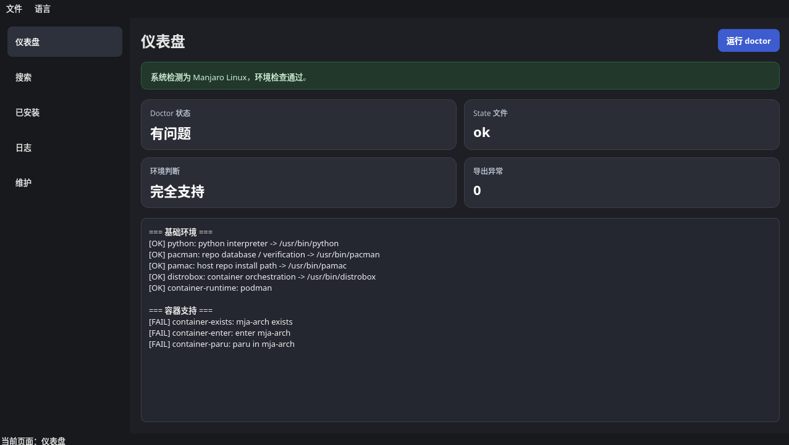

# mja: 零污染的 Manjaro AUR 隔离编排器

🌍 语言选择 (Languages): [English](README.md) | [简体中文](README.zh-CN.md)

> **厌倦了混用 AUR 动不动就搞挂你的 Manjaro 系统？**
> `mja` 是一款智能编排器，它能将高风险的 AUR 软件全自动隔离到 Distrobox 容器中运行，同时让你的宿主机根目录和官方软件库保持 100% 绝对纯净。



## ✨ 核心亮点

Manjaro 用户既想要系统稳定，又眼馋 AUR 里海量的软件。但把激进的 AUR 包和 Manjaro 延迟更新的稳定分支混用，往往会引发著名的“依赖地狱”。

`mja` 并不是一个普通的 AUR Helper，而是一个**状态机驱动的策略路由层**：
1. **官方仓库包？** 直接调用宿主机的 `pacman`/`pamac` 安装。
2. **AUR 专属包？** 自动在隔离的 Arch 容器（`mja-arch`）内通过 `paru` 编译安装。
3. **无感穿透？** 自动将 GUI 软件的 `.desktop` 图标或 CLI 工具的二进制文件导出到宿主机。用起来就像原生安装的一样。

## 🚀 极速安装 (GUI 版)

我们提供了一个极简的原生图形界面。

**⚠️ 警告：** 在 Arch/Manjaro 系统中，**严禁使用 `pip install PySide6`**，这会破坏系统的 externally-managed 环境。请务必使用系统包管理器安装依赖：

```bash
# 1. 安装 Qt 依赖
sudo pacman -S pyside6

# 2. 克隆仓库并运行一键安装脚本
git clone https://github.com/molang163/mja.git
cd mja
bash install.sh
```

安装完成后，你可以直接在开始菜单找到 **mja GUI** 的图标，或者在终端输入 `mja-gui` 启动。

## 🧹 强迫症福音：干净卸载

我们极其尊重你的系统洁癖。有干净的安装，就有不留痕迹的卸载：

```bash
# 进入源码目录执行：
bash uninstall.sh         # 普通卸载（移除软件本体，保留历史状态和日志）
bash uninstall.sh --purge # 核弹级卸载（连同配置、状态机、缓存彻底抹除）
```
*(注：卸载前，建议先在 mja 界面中把你安装过的 AUR 软件卸载掉，以清理导出的快捷方式。)*

## ⌨️ CLI 高级用法

对于喜欢纯终端环境的高级玩家，`mja` 提供了对等甚至更强大的命令行接口。你可以直接运行 `mja` 子命令：

```bash
# 智能搜索 (同时查询宿主机官方库与 AUR)
mja search obsidian

# 安装 AUR 软件并自动导出桌面图标
mja install obsidian --source aur --export auto

# 查看健康诊断与系统状态
mja doctor

# 列出、更新或卸载
mja list
mja update --all
mja remove obsidian --unexport
```
